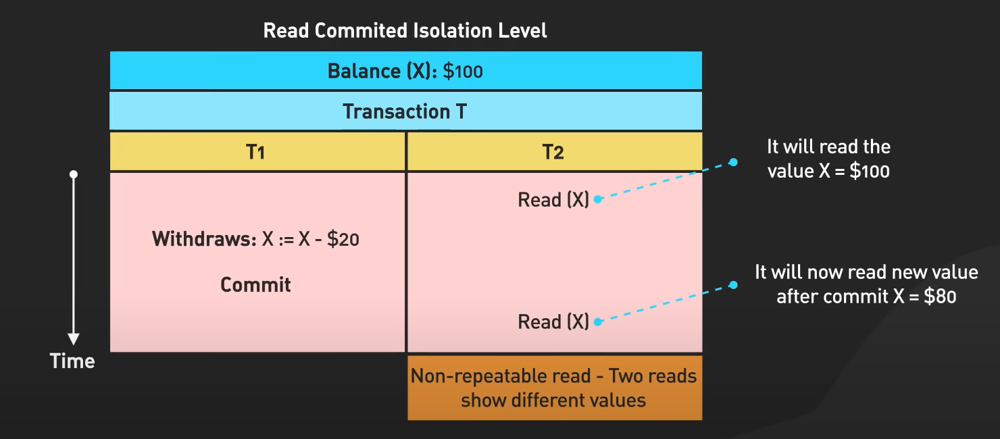

# Normalization:

- 1NF:
  - Each record has a unique primary key 
  - Each table cell contains a single value
- 2NF:
  - Non-key attributes are fully functionally dependent on the primary key.
- 3NF:
   - Non-key attributes depend only on the primary key, not on other non-key attributes (eliminate transitive dependencies Key -> Attr1 -> Attr2 )
- BCNF (Boyce-Codd Normal Form):
	Every determinant must be a candidate key.
- 4NF:
	multi-valued dependency on the full key.
- 5NF:
	Tables should be free from join dependencies and any form of redundancy

About 3NF: https://www.youtube.com/watch?v=GFQaEYEc8_8

About 4NF:

About 5NF:

# ACID

Isolations:

Dirty Read

# CAP

#Nosql

## MongoDB vs Cassandra

Когда использовать?

Cassandra для высокой доступности:
    высокое время безотказной работы
    распределенная архитектура

MongoDB для данных которые постоянно меняются:
    неструктурированные данные с помощью документоориентированного подхода
    ACID complaint
    
https://aws.amazon.com/ru/compare/the-difference-between-cassandra-and-mongodb/

https://www.mongodb.com/resources/compare/cassandra-vs-mongodb

